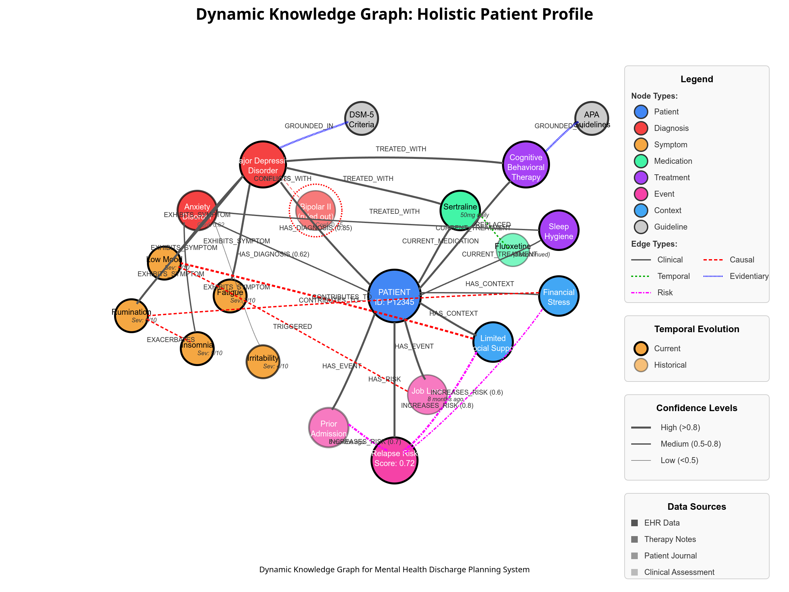

# Multi-Agent System for Mental Health Discharge Planning

## System Architecture

This system employs a multi-agent architecture centered around a dynamic knowledge graph to assist clinicians with discharge planning, risk prediction, and clinical handoff for mental health patients.

### Architecture Overview

```
                   Orchestrator Agent
                          │
                ┌─────────┼─────────┐
                │         │         │
      ┌─────────▼────┐    │    ┌────▼─────────┐
      │ Structured   │    │    │ Unstructured │
      │ Data Agent   │    │    │ Data Agent   │
      └─────────┬────┘    │    └────┬─────────┘
                │         │         │
                └────► Knowledge ◄───┘
                       Graph
                         │
        ┌────────┬───────┼───────┬────────┐
        │        │       │       │        │
        ▼        ▼       ▼       ▼        ▼
┌─────────────┐  │  ┌─────────┐  │  ┌──────────┐
│    Risk     │  │  │Diagnostic│  │  │  Care    │
│ Prediction  │◄─┼─►│Research  │◄─┼─►│  Plan    │
│   Agent     │  │  │  Agent   │  │  │  Agent   │
└─────┬───────┘  │  └────┬─────┘  │  └────┬─────┘
      │          │       │        │       │
      └──────────┼───────┼────────┼───────┘
                 ▼       ▼        ▼
           ┌──────────────────────────┐
           │    Summarization Agent   │
           └──────────┬───────────────┘
                      │
                      ▼
           ┌──────────────────────────┐
           │    Clinician Interface   │
           └──────────────────────────┘
```

## Dynamic Knowledge Graph Implementation

To create a holistic user profile that integrates structured and unstructured data for better retrieval, reasoning, and risk analysis in mental health discharge planning, a knowledge graph offers a powerful solution. This approach enables agents in the multi-agent AI system to retrieve relevant data efficiently, reason about connections (e.g., symptoms to diagnoses), and identify flags or risks comprehensively.
The graph serves as a centralized data store, enabling agents to query specific subgraphs efficiently:

### Technical Implementation
```
- Backend: Neo4j Graph Database
- Schema: Extended property graph model
- Query Language: Cypher for CRUD operations
- API: GraphQL for agent interactions
- Versioning: Temporal modeling with datetime stamps
- Storage: Multi-model (graph + document) for efficient querying
```

### Data Structure
- **Node Properties**: Metadata including timestamp, source, confidence, version
- **Edge Properties**: Relationship strength, evidence level, provenance
- **Indexing**: B-tree indexes on frequently queried node properties
- **Constraints**: Uniqueness constraints on node identifiers
- **Query Caching**: LRU cache for frequent pattern queries
- **Access Control**: Role-based access for different agent operations

### Conflict Resolution Framework
- Rule-based conflict detector identifies contradictory assertions
- Bayesian confidence scoring for contradictory information
- Source reliability weighting matrix (clinician > structured EHR > patient report)
- Temporal resolution with exponential decay on information relevance
- Explicit uncertainty representation using probability distributions

### Sample Knowledge Graph for patients holistic view:




## Detailed Agent Specifications and Alignment

### 1. Orchestrator Agent


#### Orchestration Mechanisms
- **Task Scheduling**: Priority queue with risk-based prioritization
- **Dependency Resolution**: Topological sorting of agent dependencies
- **Parallel Execution**: Thread pool for concurrent agent tasks
- **Transaction Management**: Two-phase commit for graph updates
- **Timeout Handling**: Configurable timeouts with fallback mechanisms
- **Retry Logic**: Intelligent retry with increasing delays


### 2. Knowledge Extraction Agents

#### Structured Data Agent
- **Data Sources**: HL7 FHIR API, postgre sql databases, structured EHRs
- **Preprocessing Pipeline**:
  ```
  Raw Data → Validation → Normalization → Entity Resolution → Ontology Mapping → Knowledge Graph Integration
  ```
- **Technical Components**:
  - UMLS Metathesaurus for medical concept normalization
  - Entity resolution via deterministic and probabilistic matching
  - Schema mapping with FHIR-to-graph transformation rules
  - Incremental loading with change data capture
  - Data quality scoring using completeness, consistency metrics
- **Error Handling**:
  - Missing data imputation with explicit confidence reduction
  - Anomaly detection for outlier identification
  - Integrity constraint validation
  - Lineage tracking for data provenance

#### Unstructured Data Agent
- **Data Sources**: Therapy transcripts, clinical notes, patient journals
- **NLP Pipeline**:
  ```
  Text → Preprocessing → NER → Relation Extraction → Sentiment Analysis → Coreference Resolution → Negation Detection → Knowledge Graph Integration
  ```
- **Technical Components**:
  - ClinicalBERT (fine-tuned on mental health corpus)
  - BiLSTM-CRF for medical entity recognition
  - Dependency parsing for relation extraction
  - VADER with clinical adaptation for sentiment analysis
  - MedSpaCy for medical-specific NLP tasks
- **Error Handling**:
  - Context-aware negation handling (NegEx algorithm)
  - Uncertainty detection with modality classification
  - Entity disambiguation using UMLS semantic types
  - Confidence scoring based on linguistic features
  - Text span anchoring for source verification

#### Agent Alignment
- **Data Synchronization**: Vector clock for ordering updates
- **Entity Resolution**: Cross-agent entity matching using semantic similarity
- **Schema Coherence**: Shared ontology for consistent node/edge typing
- **Update Coordination**: Distributed locks for simultaneous updates

### 3. Risk Prediction Agent

This agent working is highly speculative and is based on limited information on the availability of data. Better approaches can be generated for risk prediction model. However without proper understanding of how the risk prediction works in clinical environment its hard to determine a proper approach.
Hence this approach is a copy-pasted approach based on general risk classfication models. 

#### Technical Implementation
- **Model Architecture**: Ensemble of gradient-boosted trees and graph neural networks
- **Feature Engineering**:
  - Temporally-aware feature extraction
  - Graph embeddings using Node2Vec
  - Graph motif counting for pattern recognition
  - Path-based features for causal chains
  - Aggregated symptom severity metrics
- **Training Pipeline**:
  ```
  Graph Features → Feature Selection → Class Balancing → Cross-Validation → Hyperparameter Tuning → Model Ensemble → Calibration
  ```
- **Inference Pipeline**:
  ```
  Patient Subgraph → Feature Extraction → Model Prediction → Confidence Calculation → Risk Factor Attribution → Knowledge Graph Update
  ```
- **Explainability Mechanisms**:
  - SHAP values for feature importance
  - Counterfactual explanations for risk factors
  - Partial dependence plots for feature impact
  - Local interpretable model-agnostic explanations (LIME)
  - Risk factor attribution with confidence intervals

#### Integration Points
- **Input Dependencies**:
  - Knowledge Graph: Current patient state, historical patterns
  - Structured Data Agent: Labs, vitals, medications, diagnoses
  - Unstructured Data Agent: Behavioral indicators, adherence factors
- **Output Utilization**:
  - Diagnostic Research Agent: Risk-prioritized diagnostic focus
  - Care Plan Agent: Risk-stratified intervention intensity
  - Summarization Agent: Risk highlighting and explanation
- **Feedback Loops**:
  - Model drift detection via performance monitoring
  - Retraining triggers based on prediction accuracy
  - Continuous feature importance evaluation

#### Error Handling
- **Data Quality Issues**:
  - Missing feature imputation using MICE algorithm
  - Outlier detection with isolation forests
  - Confidence reduction for uncertain features
- **Prediction Uncertainty**:
  - Bayesian prediction intervals
  - Ensemble disagreement metrics
  - Out-of-distribution detection
  - Confidence thresholds for high-risk decisions

### 4. Diagnostic Research Agent

#### Technical Implementation
- **Core Architecture**: Hybrid symbolic-neural reasoning system
- **Components**:
  - RAG system with clinical guideline corpus
  - Inference engine for diagnostic criteria matching
  - Bayesian network for differential diagnosis
  - Decision tree for treatment option evaluation
  - Constraint satisfaction solver for treatment conflicts

- **Diagnosis Pipeline**:
  ```
  Patient Profile → Symptom Extraction → DSM-5/ICD-10 Criteria Matching → Confidence Calculation → Differential Generation → Evidence Linking → Knowledge Graph Update
  ```
- **Treatment Analysis Pipeline**:
  ```
  Diagnoses → Guideline Retrieval → Treatment Option Extraction → Patient-Specific Filtering → Effectiveness Prediction → Barrier Analysis → Recommendation Ranking
  ```
- **Clinical Reasoning Framework**:
  - Chain-of-thought prompting for step-by-step reasoning
  - Rule-based criteria matching with fuzzy logic
  - Temporal reasoning for symptom progression
  - Causal modeling for symptom-diagnosis relationships

#### Integration Points
- **Input Dependencies**:
  - Knowledge Graph: Patient symptoms, history, context
  - Risk Prediction Agent: Risk factors to prioritize analysis
  - Structured/Unstructured Data Agents: Clinical indicators
- **Output Utilization**:
  - Care Plan Agent: Diagnostic confidence, treatment assessments
  - Summarization Agent: Diagnostic reasoning chains
  - Knowledge Graph: Diagnostic assertions with evidence links
- **Alignment Mechanisms**:
  - Regular synchronization with Risk Prediction findings
  - Treatment recommendation prioritization based on risk factors
  - Evidence strength weighting informed by data agent confidence

#### Error Handling
- **Diagnostic Uncertainty**:
  - Multi-hypothesis tracking for ambiguous presentations
  - Explicit representation of differential likelihoods
  - Identification of discriminating data needs
  - Confidence thresholds for diagnostic assertions
- **Treatment Conflicts**:
  - Drug interaction detection with severity classification
  - Contraindication checking against patient profile
  - Treatment effectiveness risk adjustment
  - Alternative recommendation generation

### 5. Care Plan Agent

#### Technical Implementation
- **Architecture**: Multi-stage pipeline with verification gates
- **Components**:
  - Treatment recommendation engine
  - Risk-based intervention planner
  - Follow-up schedule optimizer
  - Barrier analysis module
  - Guideline conformance checker

- **Care Plan Generation Pipeline**:
  ```
  Patient Profile → Risk Assessment Integration → Diagnostic Insight Integration → Guideline Retrieval → Treatment Planning → Follow-up Scheduling → Barrier Analysis → Contingency Planning → Validation → Documentation
  ```
- **Technical Methods**:
  - Integer programming for optimal intervention selection
  - Decision trees for treatment pathways
  - Monte Carlo simulation for adherence prediction
  - Constraint-based reasoning for guideline conformance
  - Template-based generation with parameter optimization

#### Integration Points
- **Input Dependencies**:
  - Knowledge Graph: Complete patient profile
  - Risk Prediction Agent: Risk score and factors
  - Diagnostic Research Agent: Diagnoses, treatment evaluations
  - Structured/Unstructured Agents: Patient preferences, context
- **Output Utilization**:
  - Summarization Agent: Care plan components and rationale
  - Knowledge Graph: Structured care plan representation
  - Clinician Interface: Interactive care plan visualization
- **Synchronization Methods**:
  - Bidirectional consultation with Diagnostic Agent
  - Risk threshold triggers for intervention intensity
  - Dynamic replanning based on diagnostic updates
  - Real-time validation against knowledge graph state

#### Error Handling
- **Treatment Conflicts**:
  - Contradictory recommendation detection
  - Polypharmacy risk analysis
  - Guideline priority resolution for conflicting guidance
  - Patient-specific adaptation with explicit justification
- **Adherence Barriers**:
  - Systematic barrier identification from context
  - Intervention feasibility scoring
  - Resource availability checking
  - Alternative delivery method generation

### 6. Summarization Agent

#### Technical Implementation
- **Architecture**: Hierarchical extractive-abstractive pipeline
- **Components**:
  - Knowledge graph traversal engine
  - Key information extractor
  - Citation manager
  - Natural language generator
  - Coherence validator

- **Summarization Pipeline**:
  ```
  Knowledge Graph Query → Information Relevance Scoring → Content Selection → Hierarchical Structuring → Natural Language Generation → Citation Linking → Coherence Checking → Format Adaptation
  ```
- **Technical Methods**:
  - Graph centrality algorithms for key node identification
  - Extractive summarization for critical information
  - Abstractive generation for narrative cohesion
  - Citation mapping to knowledge graph paths
  - Factual consistency checking via entailment

#### Integration Points
- **Input Dependencies**:
  - Knowledge Graph: Complete patient representation
  - Risk Prediction Agent: Risk assessment with factors
  - Diagnostic Research Agent: Diagnostic reasoning chains
  - Care Plan Agent: Structured care plan components
- **Output Utilization**:
  - Clinician Interface: Final summary presentation
  - Knowledge Graph: Summary nodes linked to sources
- **Cross-Agent Verification**:
  - Fact verification against source agents
  - Risk emphasis calibrated to prediction confidence
  - Treatment summary aligned with care plan priorities
  - Diagnostic reasoning faithful to research agent logic

#### Error Handling
- **Content Selection Issues**:
  - Information priority scoring to prevent omissions
  - Critical item checklist validation
  - Domain-specific completeness metrics
  - Clinician preference adaptation
- **Factual Accuracy**:
  - Logical consistency checking
  - Entailment verification against knowledge graph
  - Citation path validation
  - Confidence scoring for generated statements

## Agent Coordination and Workflow Orchestration

### Workflow Lifecycle

1. **Initialization Phase**
   ```
   Orchestrator → Data Agents → Knowledge Graph Construction
   ```
   - Patient record identifier triggers workflow instantiation
   - Data agents execute in parallel with coordination points
   - Knowledge graph baseline constructed with initial confidence scores
   - Entity resolution across data sources with identity management

2. **Analysis Phase**
   ```
   Risk Prediction ⟷ Diagnostic Research ⟷ Care Plan Generation
   ```
   - Risk Prediction initiates with preliminary graph analysis
   - Diagnostic Research begins with symptom cluster extraction
   - Bidirectional information exchange via graph updates
   - Progressive refinement through iterative analysis

3. **Synthesis Phase**
   ```
   Risk + Diagnostics + Care Plan → Summarization → Clinician Interface
   ```
   - Final risk assessment integrated with diagnostic conclusions
   - Care plan validated against diagnostic confidence
   - Summarization agent creates clinically relevant abstract
   - Complete package presented through clinician interface


### Agent Alignment Techniques

#### Knowledge Graph as Coordination Medium
- Graph as source of truth for all agents
- Transactional updates maintain consistency
- Node locking prevents concurrent modifications
- Change notification system for dependent agents

#### Inter-Agent Consultation
- Bidirectional API calls for critical decisions
- Risk Prediction ⟷ Diagnostic Research:
  - Risk factors influence diagnostic priority
  - Diagnostic confidence adjusts risk calculations
- Diagnostic Research ⟷ Care Plan:
  - Treatment evaluations guide care plan components
  - Care plan feasibility issues trigger diagnostic reassessment
- Care Plan → Risk Prediction:
  - Intervention selections feed back to risk reassessment

#### Continuous Validation
- Cross-checking mechanisms between agent outputs
- Knowledge graph consistency validation after updates
- Logical rule checking for impossible states
- Probabilistic coherence metrics for uncertain assertions

#### Feedback Integration
- Clinician feedback captured and attributed to agent outputs
- Reinforcement learning for agent decision optimization
- Quality metrics drive agent improvement priorities
- Disagreement tracking for detecting systematic biases

## Technical Implementation Details

### Data Processing and ETL

- **Structured Data Pipelines**:
  - HL7 FHIR API clients for EHR integration
  - Apache NiFi for data flow orchestration
  - Kafka streams for real-time processing
  - Spark for batch aggregation jobs
  - Delta Lake for data versioning

- **Unstructured Data Pipelines**:
  - Speech-to-text for therapy recordings
  - JSON-based document store for text data
  - Elasticsearch for full-text indexing
  - BERT-based embeddings for semantic search
  - Apache Tika for document format handling

### Knowledge Graph Technology

- **Graph Database**: Neo4j Enterprise with APOC and Graph Data Science libraries
- **Ontology Management**: OWL/RDF with reasoners for consistency
- **Query Performance**: Parameterized Cypher with query optimization
- **Graph Updates**: Batch operations with transaction management
- **Visualization**: Neo4j Bloom for interactive exploration

### LLM and RAG Components

- **Base Models**: Clinical domain-specific models (BioGPT, ClinicalBERT)
- **RAG Architecture**: Dense passage retrieval with BM25 hybrid search
- **Vector Database**: Pinecone for embedding storage
- **Prompt Engineering**: Chain-of-thought templates with few-shot examples
- **Output Validation**: Factual consistency checking via entailment
- **Response Generation**: Constrained decoding with clinical guidelines

## Evaluation Framework

### Technical Performance Metrics

- **Risk Prediction**:
  - ROC-AUC (target: >0.85)
  - Precision@k for high-risk patients (target: >0.80)
  - Calibration error (target: <0.05)
  - Feature importance stability (Jaccard similarity >0.7)

- **Diagnostic Research**:
  - Diagnosis accuracy vs. clinician (target: Cohen's κ >0.80)
  - Evidence retrieval precision/recall (target: F1 >0.85)
  - Treatment appropriateness (clinician agreement >85%)
  - Reasoning step validity (logical consistency >95%)

- **Care Plan**:
  - Guideline adherence rate (target: >90%)
  - Intervention specificity score (target: >8/10)
  - Barrier identification recall (target: >85%)
  - Contingency coverage for critical risks (target: 100%)

- **Summarization**:
  - ROUGE scores vs. expert summaries (target: ROUGE-L >0.7)
  - Factual accuracy (target: >95% verifiable statements)
  - Information completeness (critical element inclusion >95%)
  - Citation accuracy (source verification success >98%)

### Clinical Effectiveness Metrics

- **Overall System**:
  - Care plan modification rate (target: <20%)
  - Decision confidence improvement (target: >30%)

### Integration Performance

- **Agent Coordination**:
  - Inter-agent consistency rate (target: >95%)
  - Processing latency (target: <30 seconds end-to-end)
  - Failure recovery success rate (target: >99%)
  - System availability (target: >99.9%)

## Final Notes:

This multi-agent system leverages a sophisticated dynamic knowledge graph and specialized agents to assist clinicians in mental health discharge planning. Through careful technical integration and alignment between agents, it provides a comprehensive solution for predicting relapse risk, generating personalized care plans, and summarizing key clinical insights. The system's architecture emphasizes evidence-based reasoning, explicit uncertainty handling, and transparent decision processes to support clinician trust while improving patient outcomes.


With mental health, its tough as a tremendous number of factors affect a patient.
There can be various sources of cause and triggers for relapse.
A person who shows signs of high recovery in a controlled environment, could fail when facing the past triggers, or when dealing with real world unpredictable environment. 


#### AgentCause
	Agent is used for determining, what can be causing the recent changes, or recent symptoms, that the patient is seeing.
	This agent is basically assesing all the data from patient metrics, heart rate, menstrual cycle, hormonal  changes, 
	This is basically assesing the physical cause that may be causing certain symptoms. 

#### PastHistory 
	Asses previous diagnosis, and what all the patient has experienced medically, to asses what works and especially WHAT DOENST WORK. 
	But this data is available, how do I make it useful here?

#### On Risk Prediction
   To evaluate the Risk Prediction Agent and other agents in the mental health discharge planning system, we create a high-quality dataset with clinician-generated profiles as ground truth, split into controlled (low variability) and high-variability cases. For the Risk Prediction Agent, clinicians provide risk assessments (e.g., “70% relapse risk, factors: isolation, non-adherence”), while for high-variability cases, they also note missing data needs (e.g., “requires trauma history”). An LLM compares agent outputs to these profiles, measuring precision (risks matching clinician’s), recall (clinician risks captured), and F1-score, with penalties for missed critical risks (e.g., -5% per miss). Extra risks identified by the agent are logged as potential strengths for later validation.
   In controlled cases, we test baseline accuracy (e.g., “Agent: 60% risk, isolation” vs. “Clinician: 65%, isolation”), refining the agent’s logic (e.g., emphasize event nodes) if misses occur. For high-variability cases, the agent suggests data gaps (e.g., “request substance use history”), scored against clinician annotations for accuracy. This dual approach—refining core performance on simple cases and enhancing adaptability on complex ones—extends to other agents (e.g., Diagnostic Reasoning Agent: diagnosis match; Care Plan Agent: intervention overlap). Iterative testing and feedback ensure agents align with clinician expertise, improving reliability across scenarios while maintaining coherence and actionability.

